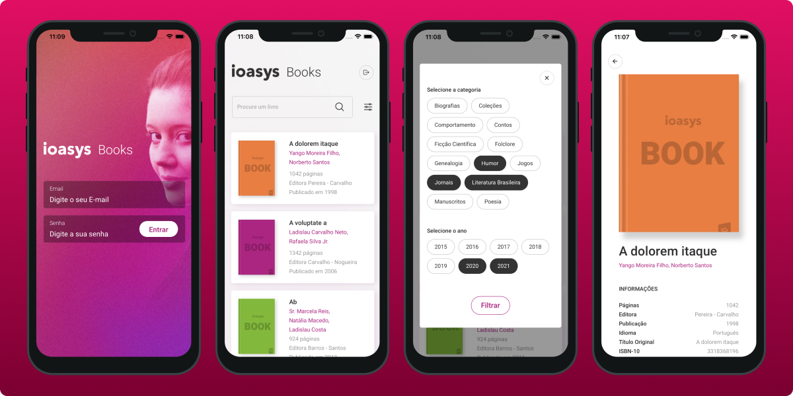

## Sobre

Ioasys Books, se trata de um aplicativo desenvolvido para o desafio técnico da Ioasys.


## Screenshot




##  Bibliotecas Utilizadas
Para o desenvolvimento do aplicativo foram utilizadas as seguintes bibliotecas:  

- [async-storage](https://www.npmjs.com/package/@react-native-community/async-storage)
- [styled-components](https://styled-components.com/e)
- [react-native-vector-icons](https://www.npmjs.com/package/react-native-vector-icons)
- [react-native-responsive-fontsize](https://www.npmjs.com/package/react-native-responsive-fontsize)
- [axios](https://axios-http.com/docs/intro)
- [unform](https://unform.dev/)
- [react-navigation](https://reactnavigation.org/)
- [eslint](https://eslint.org/)
- [prettier](https://prettier.io/)

  
## APK do aplicativo

Link do apk do aplicativo: [ioasys-book.apk](https://github.com/LuisPeixoto/ioasys-books/releases/tag/ioasysbooks.apk)


## Instalação

### Clone do repositório

```bash
$ git clone https://github.com/LuisPeixoto/ioasys-book

$ cd ioasys-book
```

### Instalação das dependências

```bash
$ yarn install
```

### Execução

```bash
$ yarn android
```

ou

```bash
$ yarn ios
```
